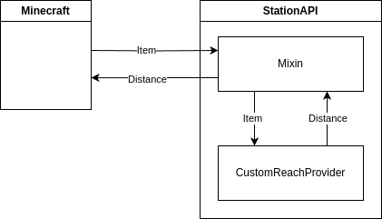
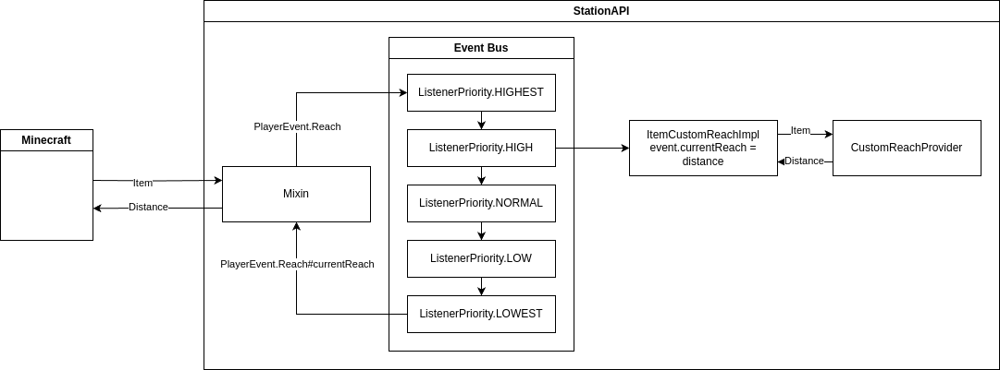
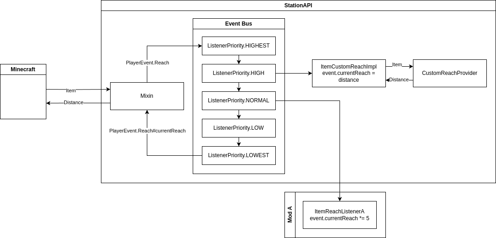
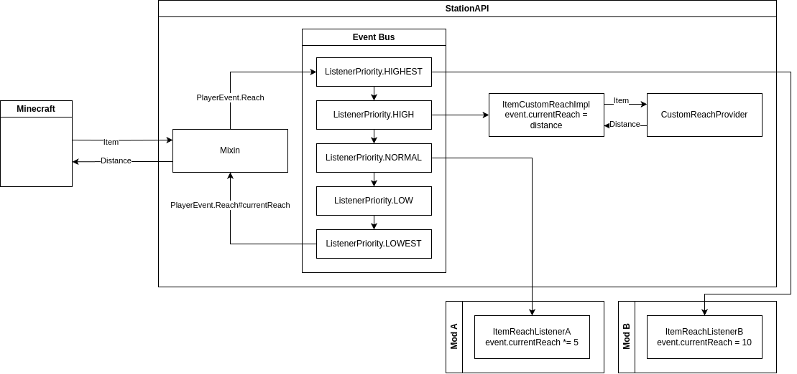

Any and all help is very welcome, though we have a handful of rules and standards that must be followed.

First and foremost, to get the elephant in the room out of the way:

LLMs and "AI" agents are expressly forbidden from making unattended PRs, generating most of the code of your PR, and writing on your behalf anywhere where StaionAPI development is had. This primarily includes the GitHub, and the modification station discord.

ML assistance like autocomplete and code fragments are fine.

This stance is partly because LLMs are prone to making stuff up and generating wild amounts of boilerplate. The main reason is because they have absolutely no training data on how StationAPI and an obscure version of Minecraft interact. We (both mine_diver and calmilamsy) have checked and validated this ourselves, it will hallucinate and generate garbage code.

# General Design Principles

- You must write your new code within a pre-existing module if it makes sense.
- Your code must use and integrate with existing API features.
- Ideally, the there should be absolutely no difference in gameplay or visuals when StationAPI is installed by itself. (Exceptions: loading screens, debug features like f3)
- New assets (art, translations, any file that isn't code or part of the build script) must be avoided where reasonable. Try to reuse or adapt vanilla ones before adding new ones.

# Code Format

- Indentation: 4 spaces

# Pull Requests

- All PRs must be made on the `develop` (default) branch.
- You must be able to explain your code, and provide reasoning for your choices.
- Any code you contribute to the main repo MUST be MIT or relicensable to MIT. We are not going to entertain multiple licences.

# Structuring New Features

## Abstraction Layers

Try and introduce multiple abstraction layers to the feature you're working on.

This makes your feature more flexible and gives more freedom to the mods for hooking into the API.

### Example

You want to create an interface that, when implemented by an item,
allows it providing custom reach distance.

You create a new interface called `CustomReachProvider` and create a mixin which checks
if the held item implements this interface, and, if it does, overrides the vanilla reach distance
with the one returned by the held item.

The overall chain of calls in this implementation looks like this:



#### Issue

What if another mod adds an accessory item that multiplies the reach distance when worn?
It doesn't have a straightforward way to hook into this call chain.

#### Solution

Let's provide an event that gets dispatched in-between,
and an internal listener that handles the `CustomReachProvider` behavior.

So now the implementation looks like this:



Where `ItemCustomReachImpl` is an internal listener of `PlayerEvent.Reach` event which simply does what we initially
intended - checks if the held item implements the `CustomReachProvider` interface, and, if it does,
overrides the vanilla reach distance with the one returned by the held item.

Simplified, it'd look like this:

```java
class Main {
    double getReach(double vanillaReach, Item item) {
        double result = vanillaReach;
        
        // StationAPI
        if (item instanceof CustomReachProvider provider)
            result = provider.getReach();
        
        return result;
    }
}
```

Thanks to this approach, the aforementioned mod can now create its own listener of `PlayerEvent.Reach` event,
make its priority lower than the one of the internal `ItemCustomReachImpl` listener,
and multiply the distance, integrating perfectly with items that take advantage of the `CustomReachProvider` interface.



Simplified:

```java
class Main {
    double getReach(double vanillaReach, Item item) {
        double result = vanillaReach;

        // StationAPI
        if (item instanceof CustomReachProvider provider)
            result = provider.getReach();
        
        // Mod A
        result *= 5;

        return result;
    }
}
```

Another mod can now also modify just the vanilla reach distance by making its priority higher
than that of `ItemCustomReachImpl` listener. It'd modify the reach distance regardless, and after that,
`ItemCustomReachImpl` listener can override the distance again if the item in question provides one
through the `CustomReachProvider` interface.



Simplified:

```java
class Main {
    double getReach(double vanillaReach, Item item) {
        double result = vanillaReach;
        
        // Mod B
        result = 10;

        // StationAPI
        if (item instanceof CustomReachProvider provider)
            result = provider.getReach();

        // Mod A
        result *= 5;

        return result;
    }
}
```
