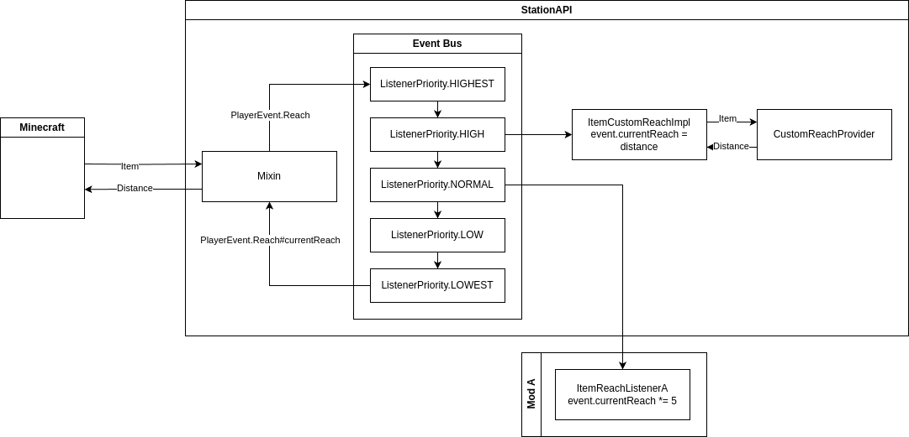

# Code Format

- Indentation: 4 spaces

# Pull Requests

Bugfix pull requests must base on the `master` branch,
while feature pull request must base on the next major version branch.

## Example

- Current version: 2.0-alpha.2.x
- Bugfix PRs are based on the `master` branch
- Feature PRs are based on the `2.0-alpha.3` branch

# Structuring New Features

## Abstraction Layers

Try and introduce multiple abstraction layers to the feature you're working on.

This makes your feature more flexible and gives more freedom to the mods for hooking into the API.

### Example

You want to create an interface that, when implemented by an item,
allows it providing custom reach distance.

You create a new interface called `CustomReachProvider` and create a mixin which checks
if the held item implements this interface, and, if it does, overrides the vanilla reach distance
with the one returned by the held item.

The overall chain of calls in this implementation looks like this:


#### Issue

What if another mod adds an accessory item that multiplies the reach distance when worn?
It doesn't have a straightforward way to hook into this call chain.

#### Solution

Let's provide an event that gets dispatched in-between,
and an internal listener that handles the `CustomReachProvider` behavior.

So now the implementation looks like this:


Where `ItemCustomReachImpl` is an internal listener of `PlayerEvent.Reach` event which simply does what we initially
intended - checks if the held item implements the `CustomReachProvider` interface, and, if it does,
overrides the vanilla reach distance with the one returned by the held item.

Simplified, it'd look like this:

```java
class Main {
    double getReach(double vanillaReach, Item item) {
        double result = vanillaReach;
        
        // StationAPI
        if (item instanceof CustomReachProvider provider)
            result = provider.getReach();
        
        return result;
    }
}
```

Thanks to this approach, the aforementioned mod can now create its own listener of `PlayerEvent.Reach` event,
make its priority lower than the one of the internal `ItemCustomReachImpl` listener,
and multiply the distance, integrating perfectly with items that take advantage of the `CustomReachProvider` interface.



Simplified:

```java
class Main {
    double getReach(double vanillaReach, Item item) {
        double result = vanillaReach;

        // StationAPI
        if (item instanceof CustomReachProvider provider)
            result = provider.getReach();
        
        // Mod A
        result *= 5;

        return result;
    }
}
```

Another mod can now also modify just the vanilla reach distance by making its priority higher
than that of `ItemCustomReachImpl` listener. It'd modify the reach distance regardless, and after that,
`ItemCustomReachImpl` listener can override the distance again if the item in question provides one
through the `CustomReachProvider` interface.


Simplified:

```java
class Main {
    double getReach(double vanillaReach, Item item) {
        double result = vanillaReach;
        
        // Mod B
        result = 10;

        // StationAPI
        if (item instanceof CustomReachProvider provider)
            result = provider.getReach();

        // Mod A
        result *= 5;

        return result;
    }
}
```